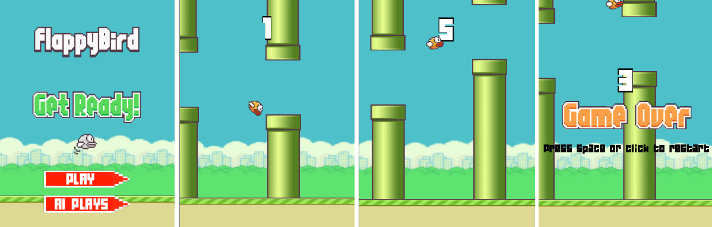

# Flappy Bird AI
## Overview
This is a Flappy Bird game implemented in Python using Pygame library. It features both manual play and an AI-driven mode using NEAT (NeuroEvolution of Augmenting Topologies).

## Features
* __Manual Mode__: Control the bird using `space` or `click` to control the bird
* __AI Mode__: Let the AI play the game.

## Required libraries
* `pygame`
* `neat-python`

## Installation
1. Clone the repository
2. Install `neat-python` and `pygame`
3. To run the game, use the following command
    `python main.py`
4. If you want to train ai using neat. Follow the below steps
   * First comment `main.run()`
   * Uncomment `main.train_ai()`
   * Run `python main.py`
   * Now the game will run the neat-algorithm based on the `config-feedforward.txt` file, until best performing model is developed. The best model is then saved as `best_ai.pkl`, which can later be used fo allow ai to play the game.
## Screenshots

